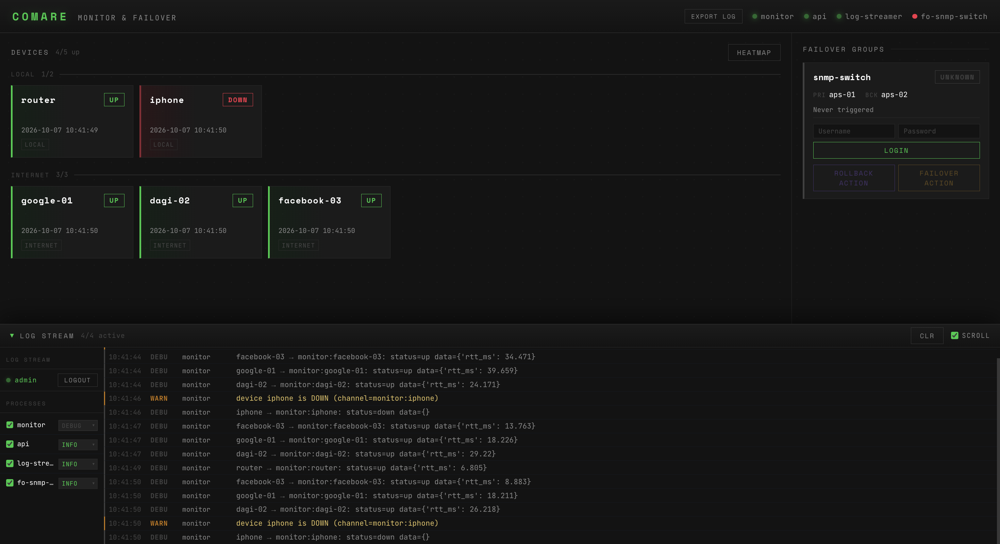
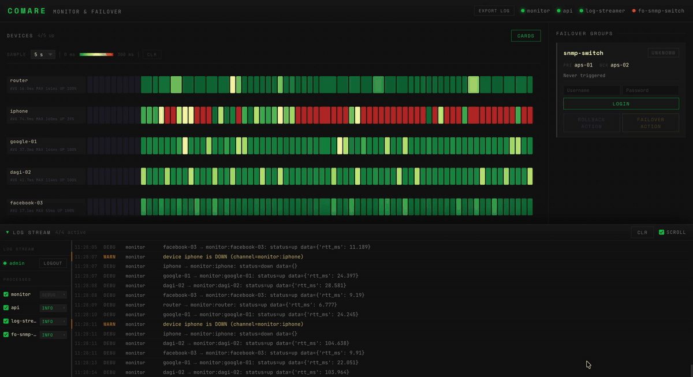
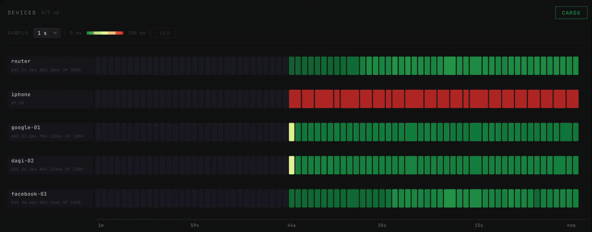
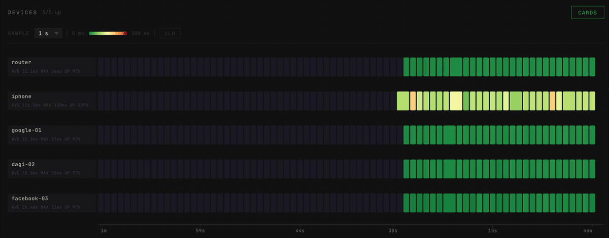
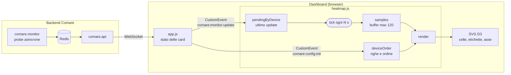

# Heatmap per la rappresentazione di stati di device monitorati

**Progetto per il corso di "Visualizzazione delle Informazioni", AA 2025/2026
Realizzato da: Gianluca Farinaccio**

Il progetto prevede la realizzazione e l'integrazione di una vista alternativa all'interno del software ***Comare***, un sistema di monitoraggio di dispositivi da me precedentemente sviluppato.

La dashboard di Comare mostrava lo stato dei device solo come schede (card), una per device, che riportano l'ultimo valore ricevuto. Una visualizzazione di questo tipo è puramente istantanea: un picco di latenza o un'interruzione breve scompaiono non appena arriva il campione successivo, e non è possibile confrontare l'andamento di più device nello stesso intervallo di tempo. Il progetto nasce per colmare questa lacuna con una visualizzazione **temporale**.

## **Il progetto**

Una vista alternativa sotto forma di Heatmap della sezione Devices, in cui ogni riga è un device e ogni colonna un istante di campionamento. L'obiettivo è quello di fornire all'utente una rappresentazione temporale dei dispositivi monitorati, in modo tale da individuare a colpo d'occhio malfunzionamenti ricorrenti ed interruzioni momentanee.

- **Colore cella**: Ogni cella rappresenta lo stato attuale del dispositivo in quell'istante di campionamento. Per **stato** si intende il RTT. La cella è colorata con una scala continua verde → giallo → rosso per RTT da 0 a 300 ms. Eventuali `down` / `timeout` vengono rappresentati come rossi fissi, mentre una assenza di dati grigio scuro.
  
  Nel caso in cui nell'istante di campionamento non sia presente un valore "fresco" fornito dal processo monitor, la visualizzazione rappresenterà quell'istante come una cella più larga.  Quando arriva un nuovo campione reale la riga torna a celle separate. Così si distingue a colpo d'occhio un valore "fresco" da uno riportato avanti nel tempo.

- **Statistiche**: Per ogni device, sul lato sinistro della visualizzazione, sono rappresentate le metriche calcolate sul buffer: **AVG-RTT**, **MAX-RTT**, **UPTIME%**.
- **Asse temporale**: Nella parte bassa della visualizzazione troviamo un asse temporale con riferimenti dinamici, calcolati in funzione dell'intervallo di campionamento e della larghezza disponibile della UI.

## **Interazioni**

### Menu `Sample` (1, 5, 10, 30, 60 s): cambia l'intervallo di campionamento della visualizzazione, cioè la durata di una cella, ed azzera la heatmap.

### Adattamento asse temporale in funzione della dimensione della finestra

## Implementazione

### Architettura

Il monitoraggio dei device è svolto esclusivamente dal processo `comare.monitor`, che esegue le probe seguendo la configurazione del sistema, dove ogni device ha il proprio intervallo di monitoraggio e timeout. Il frontend non monitora nulla: si limita a visualizzare i risultati che il processo monitor pubblica.

La feature è stata inserita in Comare mantenendo un basso accoppiamento. Essa si limita a ricevere gli eventi DOM che `app.js`, il modulo della dashboard già presente, emette quando riceve i dati. L'heatmap è stata realizzata usando la libreria **d3.js**.

### Ricezione dei dati

La heatmap reagisce a due eventi:

- `comare:config:init`: contiene l'elenco dei device e definisce le righe e il loro ordine.
- `comare:monitor:update`: contiene l'ultimo stato di un device (stato e RTT).

Un update non provoca nessun ridisegno: viene solo memorizzato in `pendingByDevice`, che tiene un unico valore per device (un nuovo update sovrascrive il precedente non ancora consumato).

### Campionamento

I device vengono sondati dal processo monitor con cadenze diverse, quindi gli update arrivano in modo irregolare. Per ottenere colonne di durata uguale, la heatmap li disaccoppia con un timer a intervallo fisso, quello scelto dal menu `Sample`.

L'intervallo di campionamento riguarda solo la visualizzazione nel browser: non modifica la frequenza con cui il monitor sonda i device, che resta quella definita in configurazione, e non genera richieste verso i device o verso il backend. Allo stesso modo, il cambio di intervallo e il pulsante `CLR` svuotano soltanto lo storico locale della heatmap.

A ogni scatto del timer (`tick`) viene aggiunto **un campione per device** a un buffer a scorrimento di 120 elementi:

- se è arrivato un update, il campione è reale e il valore in `pendingByDevice` viene consumato;
- se non è arrivato nulla, si ripete l'ultimo valore noto (`lastKnownByDevice`) e il campione viene marcato `repeated`;
- se il device non ha mai inviato dati, il campione è vuoto.

Il flag `repeated` è ciò che permette poi di disegnare le celle larghe. Il cambio di intervallo azzera i buffer perché campioni di durata diversa non sarebbero confrontabili sullo stesso asse.

### Visualizzazione con D3

Lo scheletro dell'SVG (un `<svg>` con tre gruppi: etichette, celle e asse) viene creato una sola volta all'avvio dentro `#heatmap-container`. Da lì in poi una funzione `render()` lo mantiene allineato ai dati con il pattern data join di D3: crea i nodi mancanti, aggiorna quelli esistenti e rimuove quelli in eccesso, senza mai ricostruire l'SVG.

`render()` viene richiamata a ogni `tick`, quando arriva la configurazione dei device, al cambio vista e al ridimensionamento della finestra (tramite `ResizeObserver`). Non ci sono transizioni: a ogni passaggio gli attributi sono riscritti direttamente.
